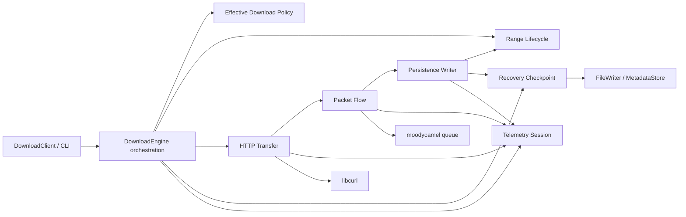

# Code Agent 交接说明

## 1. Mission

把 AsyncDownload 按阶段 0–6 重构为更深的内部模块，同时保持：

- 公开 C++ 调用方式；
- CLI 参数、配置、退出码和正式 10 项 summary schema；
- 现有恢复文件与恢复判断；
- libcurl pause/replay、Range 和连接语义；
- 单 persistence writer、无异常和 C++20；
- 已验证的性能行为。

这不是 big-bang rewrite。Code Agent MUST 一次只实施一个阶段；每个阶段单独提交、验证、
交付和回滚。

## 2. Source-of-truth order

遇到冲突时按以下顺序处理：

1. 仓库 `AGENTS.md` 的安全、代码风格、第三方源码和验证规则。
2. `docs/architecture/refactor/domain_glossary.md` 的领域术语。
3. 本目录 `wayfinder_map.md` 的范围、顺序和全局决策。
4. 当前阶段 `phases/NN_*.md` 的目标 interface 与迁移合同。
5. 当前公开 header、测试和生产源码所证明的现状。
6. `docs/performance/` 的 keeper 指标、正式 gate 和 reject 历史。
7. `.planning/` 的历史决策。

行号只作定位线索。必须用 symbol 搜索确认当前代码；不得因行号漂移跳过要求。

若当前代码已经偏离阶段文档：

- 能在不改变合同的情况下适配时，按当前 symbol 实施；
- 偏离会迫使公开接口、恢复格式或产品语义变化时，停止当前阶段并记录阻塞；
- 不得自行扩大 retry、durability、HTTP 能力或配置范围。

## 3. Target module graph



依赖必须指向深 module。`DownloadEngine` 负责 orchestration，不重新拥有被抽出的规则。

## 4. Delivery order

| Stage | Deliverable | Required predecessor | May start when |
| --- | --- | --- | --- |
| 0 | Characterization baseline | none | base commit fixed |
| 1 | Effective Download Policy | 0 | invalid-input tests exist |
| 2 | Packet Flow / Backpressure | 1 | all runtime options read from effective policy |
| 3 | Range Lifecycle | 2 | queue/pause details no longer leak into Range |
| 4 | Recovery Checkpoint | 3 | persistence completion facts use lifecycle seam |
| 5 | HTTP Transfer | 4 | recovery、Range events 和 Packet Flow seam are stable |
| 6 | Telemetry Session | 5 | all event producers have their final seams |

执行顺序固定为 0 → 1 → 2 → 3 → 4 → 5 → 6。不得并行实施相邻阶段：后续文档的接口、
producer ownership 和验证基线都以紧邻前一阶段的最终形状为输入，而且这些阶段都会触碰
`download_engine.cpp`。

## 5. One-stage execution protocol

### Step A: claim and revalidate

1. 选择对应 `tickets/WF-NNN-*.md`。
2. 记录 base commit、工作树状态和现有失败。
3. 阅读完整阶段文档及其列出的第三方/性能资料。
4. 用 `rg` 确认所有相关 symbol 和真实消费方。
5. 运行阶段前 Debug、Release 和所需 benchmark。

### Step B: tests first

先在旧实现上增加该阶段的特征化测试。测试必须观察行为，不得只断言字段或 wrapper 存在。

若测试暴露未定义行为或明显安全缺陷：

- 写出期望的确定性失败；
- 把修复与纯结构迁移拆成不同 commit；
- 不把危险现状永久固化为兼容合同。

### Step C: introduce the seam

1. 增加阶段文档选定的最小 interface。
2. 先用现有实现支撑 interface，不同时改算法。
3. 一次迁移一个调用链。
4. 每次迁移后 build 并运行聚焦测试。
5. 保持旧路径可切回，直到最后一个调用方迁移完成。

### Step D: delete the old shape

最后才删除：

- concrete dependency 泄漏；
- 旧数据袋字段；
- 重复 helper；
- 只证明旧结构存在的测试；
- 无调用方的 compatibility wrapper。

删除后用 `rg` 证明没有生产方、消费方或伪维护逻辑残留。

### Step E: verify and hand off

执行阶段文档的完整 gate，生成证据包，记录 rollback commit。未达到 gate 时不进入下一阶段。

## 6. Branch and commit protocol

建议一个阶段一个分支：

```text
codex/refactor-00-characterization
codex/refactor-01-policy
codex/refactor-02-packet-flow
codex/refactor-03-range-lifecycle
codex/refactor-04-recovery
codex/refactor-05-http-transfer
codex/refactor-06-telemetry
```

每阶段优先使用以下小提交形状：

1. `test: characterize <stage> behavior`
2. `refactor: introduce <module> interface`
3. `refactor: migrate <first caller>`
4. `refactor: migrate <remaining callers>`
5. `refactor: remove legacy <shape>`
6. `test: cover <errors/concurrency/integration>`
7. `docs: record <stage> verification`

规则：

- 一个 commit 只做一个可解释的结构变化。
- 结构迁移和性能实验 MUST NOT 在同一 commit。
- 每个 commit 都应可编译；关键迁移 commit 应可运行聚焦测试。
- 不使用 `git reset --hard`、`git clean` 或覆盖用户改动。
- 当前 tip stage 在进入下一阶段前可作为一个独立 rollback unit 回滚。
- 一旦后续阶段已经依赖其 interface，回滚更早阶段必须先按 6 → 0 的逆序回滚所有
  dependent stages；不得单独 revert 被依赖的 interface 后留下不可编译工作树。
- 回滚使用阶段提交或 PR revert，不依赖后续阶段补救。

## 7. Change classification

每个 production change 在实现前必须归入一类：

| Class | Meaning | Handling |
| --- | --- | --- |
| S | 纯结构，外部与运行语义不变 | 当前阶段允许 |
| C | 明确修复确定性 correctness/safety 缺陷 | 单独 commit + 定向测试 |
| P | 主动改变性能或背压行为 | 从结构阶段移出，另建性能实验 |
| F | 新功能或产品语义 | 当前路线禁止 |
| M | 恢复格式或 migration | 当前路线禁止，除非单独设计 |

无法归类时停止，不要用“cleanup”掩盖行为变化。

## 8. Global prohibitions

Code Agent MUST NOT 在本路线中顺手做：

- 调整默认 options、watermark、window、packet size 或 flush cadence；
- 简单放宽 queue resume 到 high watermark；
- 增加 queue drain hysteresis；
- 每轮只恢复一个 handle；
- 把 queue 变深当作默认性能答案；
- queue backlog gating flush；
- 简单拆 FileWriter read/write/flush handle；
- incremental CRC cache；
- compact metadata JSON；
- connection reuse；
- yield-based wait；
- 128 KiB packet aggregation；
- 内部固定 8 MiB window；
- 自动 retry；
- HTTP/2/3、代理、认证或新的压缩能力；Phase 5 明确分类的 identity-only、禁 decoder 和
  non-identity fail correctness 修复除外；
- 重建 TelemetrySink 或完整 event bus；
- 重新导出已退役 queue/backpressure 诊断字段；
- 仅为缩短文件而机械拆分函数；
- 新增没有两个真实实现的抽象层；
- 新增代码注释、TODO 或 FIXME。

如未来有新机制证据，可在本路线之外创建独立实验，不得改写本阶段验收门槛。

## 9. Verification ladder

### 9.1 Per-commit

```powershell
scripts\build.bat
build\tests\Debug\AsyncDownload_tests.exe --gtest_filter="<focused filter>"
```

### 9.2 Per-stage functional

```powershell
scripts\build.bat
build\tests\Debug\AsyncDownload_tests.exe
scripts\build.bat release
ctest --test-dir build -C Release --output-on-failure
```

### 9.3 Per-stage performance

使用同一环境对阶段前后各跑一次：

```powershell
python scripts\performance\benchmark.py `
  --url "http://127.0.0.1:4287/1gb_files.zip" `
  --benchmark-suite regression_v2 `
  --case-list baseline_default,balanced_candidate,memory_guard,scheduler_stress `
  --repeats 20 `
  --label "phase-N-post"
```

靠近 gate 时 repeats 使用 40。触及 packet、persistence 或 curl 热路径时，再跑 profiler
解释热点迁移。

### 9.4 Stop thresholds

出现任一情况必须停止当前阶段：

- 新增编译器 warning；
- previously passing test 失败；
- 已知 `error=740` 失败扩散或错误原因变化；
- summary 10-key schema 变化；
- legacy recovery fixture 无法加载；
- `baseline_default` 或 `balanced_candidate` 的 `avg_network_speed` /
  `avg_disk_speed` 任一中位数下降超过 5%；
- memory/pause 行为超出阶段 0 gate；
- Accounted Bytes 无法证明平衡；
- 需要从非 curl owner thread 调用 `curl_easy_pause`；
- 需要让多个 module 重新共同修改 Range 状态；
- 第三方行为只能凭 API 名称猜测；
- 需要改变公开或产品语义才能继续。

## 10. Stage evidence package

阶段交付必须包含：

- base/head commit；
- changed files 与 change class；
- 新 interface 和删除 interface；
- public/CLI/recovery schema diff；
- Debug/Release 命令与结果；
- 已知环境失败原文；
- benchmark pre/post artifact 与对比；
- profiler artifact（如适用）；
- ownership/线程/原子审计；
- 第三方契约来源；
- rollback commit；
- 未解决风险；
- 下一阶段是否已解锁。

“tests pass” 不是足够证据，必须记录命令、配置和失败集合。

## 11. Rollback matrix

“独立回滚”指当前 stage 完成、下一 stage 尚未开始时，可以只撤销该 stage 并恢复到其
pre-stage baseline。若实施 frontier 已经越过该 stage，必须先从当前 tip 按逆序撤销
dependents，再撤销目标 stage；也可以保留 dependents 并用新的 forward fix，但不能声称
早期 stage 的单独 revert 仍可工作。

| Stage | Rollback unit | Data compatibility after rollback |
| --- | --- | --- |
| 0 | tests/docs commits | no production/data change |
| 1 | policy caller migration commits | raw `DownloadOptions` unchanged |
| 2 | Packet Flow caller migration commits | packet payload and persistence format unchanged |
| 3 | Range Lifecycle caller migration commits | metadata snapshot format unchanged |
| 4 | Recovery protocol module commits | old metadata format intentionally retained |
| 5 | HTTP adapter migration commits | local recovery data unchanged |
| 6 | Telemetry internalization commits | summary schema intentionally retained |

若当前 tip stage 在没有 dependents 时无法通过阶段 revert 恢复到阶段前可工作状态，说明
提交切片过大，必须先重切。evidence package 必须记录 `rollback_frontier` 和需要逆序撤销的
dependent stage 列表。任何 slice/stage rollback 后，active suite 只能保留 pre-stage
实现能通过的 characterization；仅对应 C fix 才能通过的 tests 必须随 fix 回滚或显式禁用，
其用例合同和 red 输出保留在 evidence，不能留下 red baseline。

## 12. Review checklist

Reviewer 应逐项确认：

- interface 比被隐藏的 implementation 小；
- 删除 module 会让复杂度扩散，而不是只删除一层转发；
- 新 seam 是真实测试面，不是 mock-everything；
- in-process dependency 没有无意义 adapter；
- local-substitutable dependency 使用临时文件或本地 stand-in；
- libcurl 作为 true external dependency 有最小 fake 和真实合同测试；
- ownership、lifetime、shutdown 和 error path 都有测试；
- 旧 interface 测试已被新 deep interface 测试替代；
- 没有行为、性能或格式变化被藏在 rename/move 中；
- 每个阶段可以独立回滚。

## 13. Ready-to-use Code Agent prompt

```text
实施 AsyncDownload 渐进式架构重构的阶段 <N>，只做
docs/architecture/refactor/phases/<phase-file>.md 定义的范围。

开始前阅读 AGENTS.md、docs/architecture/refactor/domain_glossary.md、
docs/architecture/refactor/wayfinder_map.md、阶段文档和对应 WF ticket。
先记录 base commit 与现有测试失败，再在旧实现上补特征化测试。按阶段文档的接口和
tiny-commit 顺序迁移，一次只迁移一个调用链。不得改变公开 DownloadOptions/CLI、
恢复格式、正式 10 项性能 summary 或已验证运行语义；不得混入历史 reject 的性能实验。
第三方行为必须从本地源码或官方文档验证。每个 commit build，阶段结束运行 Debug、
Release、集成和规定的前后 benchmark。输出证据包、rollback commit 和下一阶段 gate。
当前阶段未被后续依赖时应能独立回滚；已有 dependents 时只允许按逆阶段顺序回滚。
若继续需要产品语义、恢复格式或公开接口决策，停止并明确报告，不自行扩大范围。
```
