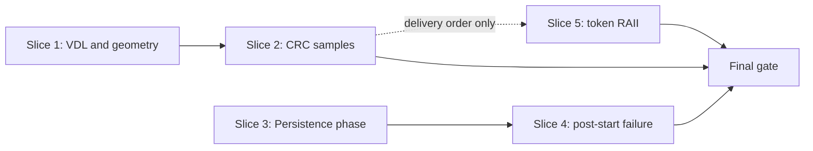

# AsyncDownload 审查必修问题核查与修复方案

## 1. 文档目的

本文核查
[`review_remediation_handoff.md`](review_remediation_handoff.md)
列出的三个必修修复包，并给出可以按独立提交实施、验证和回滚的修复方案。

核查基线：

- 日期：2026-08-02；
- 分支：`codex/refactor-06-telemetry-session`；
- `HEAD`：`9a666b936bb53e57c22160cfbdd66ff595462139`；
- 工作树中原交接文档尚未纳入版本控制，本方案只把它作为输入，不修改其内容。

本文只设计修复，不包含代码实现。后续实现不得借机改变公开 C++ interface、metadata schema、
重试策略、性能参数或正式 Performance Summary。

## 2. 核查结论

| 修复包 | 核查结果 | 优先级 | 处理决定 |
| --- | --- | --- | --- |
| Recovery metadata 结构校验 | 成立 | P1 | 必修，拆成 VDL/geometry 与 CRC sample 两个纵向切片 |
| PersistenceThread 异常清理挂起 | 成立 | P1 | 必修，但不能照搬原文提出的独立 stop 入队协议 |
| PreparedCheckpoint reservation 生命周期 | 成立 | P2 | 必修，使用可失效的共享 reservation state 实现 RAII |

三个缺陷在当前源码中都仍可触发。现有 Debug/Release 测试全绿只说明覆盖缺失，不能反证缺陷
不存在。

第二项需要纠正原交接文档中的目标设计。阶段 2 合同明确要求：

- Data Packet、Control Packet 与 close marker 保持单一 explicit producer stream；
- `PersistenceThread::stop()` 不再 enqueue；
- 正常结束通过 `PacketProducer::close()` 建立 drain barrier；
- persistence failure 由 consumer owner thread 调用 `PacketConsumer::fail()`。

因此，本方案修复 DownloadEngine 对 Packet Flow 与 Persistence Writer 的生命周期编排，
不重新引入第二条 stop/control stream，也不新增公开 stop interface。

## 3. 核查依据

结论按仓库规定的 source-of-truth 顺序得出：

1. `AGENTS.md` 的安全、第三方源码、代码风格和验证规则；
2. [`domain_glossary.md`](domain_glossary.md) 的领域术语；
3. [`wayfinder_map.md`](wayfinder_map.md) 的模块范围与全局决策；
4. 阶段 2 与阶段 4 的目标 interface 和迁移合同；
5. 当前生产源码、测试与 vendored concurrentqueue 实现。

重点来源：

- [`04_recovery_checkpoint.md`](phases/04_recovery_checkpoint.md) 第 8.2、8.4、8.5、
  10、15 和 18 节；
- [`02_packet_flow_backpressure.md`](phases/02_packet_flow_backpressure.md) 第 12.1、
  12.2、13.3、14.2 和 22 节；
- [`recovery_checkpoint.cpp`](../../../src/recovery/recovery_checkpoint.cpp)；
- [`metadata_store.cpp`](../../../src/metadata/metadata_store.cpp)；
- [`file_writer.cpp`](../../../src/storage/file_writer.cpp)；
- [`persistence_thread.cpp`](../../../src/persistence/persistence_thread.cpp)；
- [`download_engine.cpp`](../../../src/download/download_engine.cpp)；
- [`packet_flow.cpp`](../../../src/flow/packet_flow.cpp)；
- [`packet_queue_adapter.hpp`](../../../src/flow/packet_queue_adapter.hpp)；
- vendored `blockingconcurrentqueue.h` 与 `concurrentqueue.h`。

## 4. 缺陷一：Recovery metadata 结构校验

### 4.1 结论与具体触发条件

该问题成立，并且包含两条可独立造成错误信任的数据完整性路径。

#### 路径 A：越界或非边界 VDL

当前调用链为：

1. `MetadataStore::load()` 宽容解析 `vdl_offset`，不做结构校验；
2. `metadata_proves_complete()` 只拒绝 `vdl_offset < total_size`，因此
   `vdl_offset > total_size` 可以被视为 complete candidate；
3. `vdl_prefix_is_finished()` 使用 `min(serialized_vdl, total_size)`，把越界信息截断；
4. `validate_crc_samples()` 对 `offset < vdl_offset` 的 block 全部跳过 CRC；
5. validated bitmap 重新计算出完整 `safe_vdl` 后，candidate 可以进入 complete/finalize。

非 block 边界 VDL 也有同类问题。例如 `vdl_offset = 1` 时，只要首个 block 标记为
`finished`，整个首 block 都可能在没有 CRC 的情况下被继续信任。

#### 路径 B：畸形 CRC sample

当前恢复逻辑只按 offset 查找第一个 sample，不先验证 offset、length 与唯一性。

`FileWriter::read(offset, 0, bytes)` 会清空输出并返回成功。如果 metadata 同时保存空字节的
CRC32，则对应 finished block 会继续被信任。重复 offset、未对齐 offset、越界 offset、
错误的最后短 block length 也没有集中拒绝。

当前测试 `RecoveryCheckpointTest.CrcReadFailurePreservesCandidateArtifacts` 通过把 CRC length
设为 `8192` 制造越界读取。结构 validator 落地后，该输入应先返回
`metadata_parse_failed`；真实 `file_read_failed` 应改由结构合法的 fault adapter 注入测试。

### 4.2 选定设计

结构 validator 保持为 `RecoveryCheckpoint` module 的 private implementation，不放进
`MetadataStore`，也不暴露新的 public/internal header。原因如下：

- `MetadataStore` 的 interface 负责兼容解析和原子替换，不负责判断 Recovery Snapshot
  是否可信；
- identity、Effective Download Policy 与 artifact 组合只在 `RecoveryCheckpoint::open()`
  中齐全；
- 测试应通过 `RecoveryCheckpoint::open()` 这一现有 interface 观察 error、恢复结果和
  artifact bytes，不直接测试 private validator。

identity-matched candidate 的目标顺序固定为：

```text
validate request
inventory artifacts without mutation
load candidate metadata
identity mismatch -> existing required discard path
identity match -> structural validation
structurally valid -> open part in resume mode
restore bitmap and legacy range projection
validate CRC bytes
derive trusted_bytes and safe_vdl
```

这修正了原交接文档中一处过宽表述：identity mismatch 仍按阶段 4 合同进入 required discard；
只有 identity-matched、但结构矛盾的 candidate 返回 `metadata_parse_failed` 并保持 artifacts
逐字节不变。

### 4.3 Validator 合同

private validator 必须一次性检查并返回 validated block geometry：

- `total_size > 0` 且等于 remote total size；
- `block_size` 与 `io_alignment` 等于 Effective Download Policy 中的身份字段；
- `0 <= vdl_offset <= total_size`；
- VDL 是 block 边界，或恰好等于 `total_size`；
- `bitmap_states.size() <= required_block_count`，保持短 legacy bitmap 兼容；
- bitmap state 只能是 `0..2`；
- legacy range 满足
  `0 <= start <= persisted <= current <= end + 1 <= total_size`；
- persisted projection 之间不得重叠；
- CRC offset 非负、小于 total size，并且是合法 block 起点；
- CRC length 等于对应 block 的 exact expected length；
- 同一 CRC offset 最多出现一次；
- 所有加法、乘法、转换与 block index 计算均显式检查可表示性。

block count 应使用除法与余数计算，不能继续依赖可能溢出的
`total_size + block_size - 1`：

```text
quotient = total_size / block_size
remainder = total_size % block_size
block_count = quotient + (remainder == 0 ? 0 : 1)
```

block expected length 使用 `total_size - offset` 后取最小值，避免先做 `offset + block_size`。
任何不满足合同的 identity-matched candidate 都返回 `metadata_parse_failed`，且在返回前不得：

- open、truncate、preallocate 或 rename `.part`；
- remove、rewrite 或 replace metadata；
- create、overwrite 或 promote 正式 output；
- 把 candidate 降级为 fresh 后继续执行。

### 4.4 必需测试

所有拒绝测试都要在调用 `open()` 前保存 `.part`、metadata 和既有 output 的 bytes，并在返回后
逐字节比较。

VDL/geometry 测试：

- negative VDL；
- VDL 大于 total size；
- 非 block 边界 VDL；
- bitmap state 超出 `0..2`；
- bitmap 长于 required block count；
- range 的 `end + 1` 溢出或任一 frontier 越界；
- range persisted projection overlap；
- 合法短 bitmap、legacy fixture 与完整 checkpoint 继续成功。

CRC 测试：

- length 为 0 且 CRC 等于 empty CRC；
- length 小于或大于 expected length；
- 最后一个短 block 使用 full block length；
- offset 未对齐；
- offset 为负数或大于等于 total size；
- duplicate offset；
- 结构合法但 CRC 不匹配时只回退对应 block；
- 结构合法但真实读取失败时返回 `file_read_failed`，artifacts 不变。

## 5. 缺陷二：Persistence Writer 异常清理挂起

### 5.1 结论与具体触发条件

该问题成立。当前执行序列为：

```text
persistence.start()
initial_geometry_acks.reserve(...) throws
stack unwinding enters ~PersistenceThread()
stop() only writes stopping_ = true
join() waits for worker
worker repeatedly receives timeout from an open Packet Flow
join() never completes
outer catch is never reached
```

源码证据：

- `PersistenceThread::stop()` 只写一个普通 `bool stopping_`；
- `process_loop()` 不读取 `stopping_`；
- worker 只在 Packet Flow 返回 `closed`、`failed` 或自身 error 时退出；
- `DownloadEngine::run()` 在 `persistence.start()` 之后才 reserve initial geometry vector；
- outer `catch (...)` 只能在局部对象析构完成后执行；
- concurrentqueue 的 timed wait 超时只返回 `false`，不会产生 terminal event。

vendored source 的具体分支也支持该结论：

- `blockingconcurrentqueue.h:420-428` 先等待 semaphore；只有拿到 signal 后才进入
  `inner.try_dequeue()`，timeout 直接返回 `false`；
- `concurrentqueue.h:1012-1027` 的 explicit-token `enqueue()` 允许 allocation；
- `concurrentqueue.h:1077-1090` 的 `try_enqueue()` 不 allocation，但没有预留 room 时允许失败；
- `concurrentqueue.h:803-847` 说明 constructor capacity 只是按 producer 数计算预分配 block，
  不能把另一个 producer 的 stop marker 当作天然可用且有序的控制槽。

现有 Persistence tests 都先调用 producer `close()`，因此没有覆盖 open-flow teardown。

### 5.2 不采用的修复

不采用以下做法：

- 让 `PersistenceThread::stop()` 从第二个 producer stream enqueue shutdown/abort packet；
- 让 stop 与 network producer 共用同一个 thread-confined token；
- 只在 worker 的下一次 100 ms timeout 后读取 `stopping_`；
- 把异常清理伪装成下载成功；
- 新增 public cancellation interface。

前两项会破坏 Packet Flow 的单 producer total order 和 token confinement；第三项保留了无事件
轮询的脆弱生命周期；最后两项改变既定产品或公开 interface。

### 5.3 选定设计：集中 Persistence phase 生命周期

在 `download_engine.cpp` 内增加 private `PersistencePhase`，统一拥有以下 interface 语义：

- `start()`：启动 Persistence Writer，成功后立即进入 armed 状态；
- `finish(first_error)`：只执行一次 `producer.close() -> persistence.join()`，并按 first-error
  规则合并 Packet Flow/Persistence error；
- destructor：若仍 armed，按失败收尾执行同一序列且不得抛异常。

该 module 不拥有 Packet Flow 或 RecoveryCheckpoint，只持有生命周期已被外层保证的引用。
它必须声明在 `PersistenceThread` 之后、任何 HTTP session 和其它 producer-owning local object
之前。这样发生栈展开时：

1. 后创建的 HTTP session 先销毁，停止 callback 并释放 lane draft；
2. `PersistencePhase` 再关闭单一 producer stream；
3. Persistence Writer drain 已接纳 packets，执行 final checkpoint 并退出；
4. phase join worker；
5. 最后才析构 PersistenceThread、Packet Flow 和 RecoveryCheckpoint。

所有 start 后的显式 early return 都改走 `finish()`；原有
`stop_persistence_phase()` 应被该 module 吸收。随后删除：

- `PersistenceThread::stop()`；
- `PersistenceThread::stopping_`；
- 所有无效果的 `persistence.stop()` 调用；
- 声称 stop 会 enqueue shutdown 的过时 interface 说明。

这里的 `producer.close()` 是有序 drain barrier，不代表 Download Result 成功。异常或上游失败
仍由传入的 first error 决定最终结果。若 close marker 的 allocating enqueue 失败，Packet Flow
按现有合同进入 `failed`；consumer 最迟在当前 100 ms poll interval 后观察 failure。该边界已经
由阶段 2 明确接受，不在本修复中改造 vendor queue wait 机制。

### 5.4 降低 start 后的可抛操作

生命周期 guard 是 correctness 保证，预分配只是额外 hardening，不能替代 guard。

在启动 Persistence Writer 前完成并映射以下 cold-path allocation：

- initial geometry ACK storage；
- `pending_leases` capacity；
- `active_transfers` capacity。

allocation failure 映射为既定非零 `std::error_code`。新增 fault seam 应直接返回错误结果，
不再增加新的 test-only `throw std::bad_alloc()`。现有 range fault seam 的全面清理仍属于原交接
文档列出的独立规范任务，不混入该 P1 行为提交。

### 5.5 必需测试

原交接中的 raw `start -> stop -> join` 和 open-flow 直接析构测试与阶段 2 的目标 interface
冲突，替换为以下 interface-level 测试：

- open、empty Packet Flow 下，`PersistencePhase::finish(error)` 有界返回；
- Persistence start 后立即注入 cold allocation failure，DownloadEngine 返回非零 error；
- failure 发生在 initial geometry command 处理期间时，先 close/drain 再 join；
- HTTP session 已创建后的失败先销毁 session，再 close Packet Flow；
- close marker publish failure 保留 first error，并在 timeout guard 内返回；
- `finish()` 重复调用不重复 close 或 join；
- normal close 仍 drain accepted packets、完成 final checkpoint、accounting 归零；
- persistence failure 仍由 consumer thread 执行 fail/drain，orchestrator 不争夺 consumer owner；
- Debug 与 Release 都使用测试级 timeout，失败后必须主动 close 以便测试进程可回收，不能留下
  永久挂起的 future/thread。

## 6. 缺陷三：PreparedCheckpoint reservation 生命周期

### 6.1 结论与具体触发条件

该问题成立。`prepare()` 成功后把 generation 写入
`RecoveryCheckpoint::Implementation::prepared_generation`。只有合法 `commit()` 会把该字段
清零并转成 active generation。

`PreparedCheckpoint` 当前使用默认 destructor、move constructor 和 move assignment：

- token 离开作用域或被 `unique_ptr::reset()` 时，不释放 reservation；
- move assignment 覆盖已有 token 时，被覆盖 token 的 reservation 不释放；
- 后续 `prepare()` 因 `prepared_generation != 0` 永久返回 `internal_error`。

不能通过让 token destructor 回调当前 raw `owner` 指针直接修复，因为
RecoveryCheckpoint 可以先于 abandoned token 销毁，raw callback 会形成 use-after-free。

### 6.2 选定设计：可失效的共享 reservation state

在 RecoveryCheckpoint implementation 内增加一个 cold-path
`shared_ptr<ReservationState>`。该 state 集中拥有：

- mutex；
- `next_generation`；
- `prepared_generation`；
- `active_generation`；
- `last_committed_generation`；
- `last_committed_vdl`。

PreparedCheckpoint implementation 保存：

- `weak_ptr<ReservationState>`；
- generation；
- frozen metadata state；
- 是否仍拥有 prepared reservation 的标志。

token implementation destructor 执行幂等 release：

1. `weak_ptr::lock()` 失败说明 owner 已销毁，直接结束；
2. 成功时锁住 reservation state；
3. 仅当 token 仍 owns reservation 且 generation 等于当前 `prepared_generation` 时清零；
4. 不回退 `next_generation`，abandoned generation 永不复用。

合法 commit 在同一把 mutex 下完成
`prepared -> active` 转移，并在转移后 disarm token。commit 完成或失败都清除 active；只有成功
commit 更新 last committed generation/VDL。

这一设计允许 PreparedCheckpoint 的外层 move constructor 与 move assignment 继续使用
`unique_ptr` ownership：默认 move assignment 在接管 source 前会销毁 target implementation，
从而先释放 target 原有 reservation。不得把 RecoveryCheckpoint implementation 整体改成
`shared_ptr`，token 只能延长 reservation control block，不能延长 file handle 或 checkpoint
owner 的生命周期。

### 6.3 错误合同

- foreign token 提交到另一个 RecoveryCheckpoint：返回 `internal_error`，target owner 不变；
- foreign token 被消费后，其 source reservation 由 token destructor 安全释放；
- moved-from、null 或重复提交：确定性返回 `internal_error`；
- stale token 不得清除后来 token 的 reservation；
- RecoveryCheckpoint 先销毁：abandoned token destructor 无副作用且无 UAF；
- prepare allocation failure：不得发布 reservation；
- generation 在 success、failed commit 与 abandon 后都严格递增，`0` 只表示无 generation。

### 6.4 必需测试

- prepare 后 reset token，再次 prepare 成功且下一次 commit generation 为 2；
- move construction 后只有新 token 能 commit；
- move assignment 先释放 target 原 reservation，再接管 source；
- 两个 RecoveryCheckpoint 之间的 foreign commit 不破坏 target，source 随后可再次 prepare；
- moved-from/null token 的重复 commit 返回确定错误；
- RecoveryCheckpoint 先于 abandoned token 销毁时安全；
- prepare allocation failure 后可以重试；
- commit failure 清 active，后续 prepare 成功；
- success、failure、abandon 混合序列的 generation 严格单调。

## 7. 可独立领取的纵向修复切片

以下切片使用 tracer-bullet 方式拆分。每个行为切片都从现有 interface 的输入走到可观察结果、
artifact/lifetime 断言和 Debug/Release 证据，不按“先改 header、再改 cpp、最后补测试”的横向
层次拆分。

### Slice 1：拒绝畸形 VDL、bitmap 与 legacy range geometry

**Blocked by**：None，可立即开始。

**用户价值**：任何未被 metadata 合法描述的文件前缀都不能提升为可信恢复内容。

**What to build**：先加入 expected-red artifact-preservation tests，再在 RecoveryCheckpoint
内部接入 pure structural validator，关闭 VDL 与 geometry 绕过路径。

**Acceptance criteria**：

- VDL、bitmap、range 和 checked arithmetic 测试全部转绿；
- identity mismatch 的 required discard 行为不变；
- identity-matched malformed candidate 返回 `metadata_parse_failed`；
- rejected `.part`、metadata、output 逐字节不变；
- legacy fixture 与合法 short bitmap 继续成功。

### Slice 2：拒绝畸形 CRC sample 并保留合法 CRC rollback

**Blocked by**：Slice 1。

**用户价值**：VDL 之后只有读取了 exact block bytes 并通过 CRC 的 finished block 才能被信任。

**What to build**：在同一 private validator 中增加 CRC offset、exact length 与 uniqueness
检查；修正旧的越界 length 测试，并保留结构合法的 FileWriter read failure 测试。

**Acceptance criteria**：

- zero/short/long/tail length、unaligned/out-of-range/duplicate offset 全部结构拒绝；
- malformed input 不调用 `FileWriter::read()`；
- valid CRC 保留 block，CRC mismatch 只回退对应 block；
- true read failure 仍返回 `file_read_failed`；
- artifacts 保持规则全部通过。

### Slice 3：集中 Persistence phase 收尾并删除空 stop interface

**Blocked by**：None，可与 Slice 1 并行开发，但同一工作树中应避免文件冲突。

**用户价值**：所有生产路径使用同一个 close/drain/join 顺序，caller 不再需要记忆分散的
shutdown 规则。

**What to build**：先以现有 green tests 锁定正常 close，再引入 private PersistencePhase，
迁移所有显式 early return，删除 `stop()`、`stopping_` 和旧 helper。

**Acceptance criteria**：

- normal close/drain/final checkpoint 行为不变；
- 所有 start 后 return 都经过 phase `finish()`；
- destructor fallback 为 `noexcept` 且只执行一次；
- 没有第二个 producer、shutdown packet 或 public interface；
- Packet Flow/Persistence 的 first error 规则不变。

### Slice 4：让 post-start failure 有界返回

**Blocked by**：Slice 3。

**用户价值**：资源不足或异常清理返回错误，不把下载任务永久挂住。

**What to build**：在 start 前完成 cold buffer allocation，加入不抛异常的 failure-result seam，
覆盖 initial geometry、HTTP session lifetime 与 close publish failure。

**Acceptance criteria**：

- 所有定向 failure 测试在 Debug/Release timeout 内完成；
- `DownloadEngine::run() noexcept` 返回非零 error；
- first error 不被 close/join 的连带错误覆盖；
- artifacts 被保留，Packet Flow accounting 归零；
- normal path 无新增 poll、retry 或性能参数变化。

### Slice 5：让 PreparedCheckpoint reservation 具备 RAII ownership

**Blocked by**：逻辑上 None。为减少 `recovery_checkpoint.cpp` 冲突，建议在 Slice 2 后交付，
但不得与 Slice 1/2 合并为同一提交。

**用户价值**：调用方可以安全移动、放弃或销毁 prepared token，不会永久锁死 checkpoint。

**What to build**：加入 expected-red abandon/move/foreign tests，引入 weak reservation state，
统一 prepare、commit、abandon 的 generation state machine。

**Acceptance criteria**：

- abandon、move construct、move assign、foreign、null 与 owner-first destruction 全部转绿；
- 任意时刻最多一个 prepared owner 和一个 active commit；
- reservation 恰好释放或转移一次；
- generation 不复用、不倒退；
- 不延长 RecoveryCheckpoint/FileWriter 生命周期。

### 依赖图



## 8. 验证方案

### 8.1 当前有效基线

在未修改生产代码的当前基线上串行执行：

| 配置 | 范围 | 结果 |
| --- | --- | --- |
| Debug | RecoveryCheckpoint、RecoveryCharacterization、PersistenceThread | 55/55，exit 0 |
| Release | RecoveryCheckpoint、RecoveryCharacterization、PersistenceThread | 55/55，exit 0 |
| Debug | recovery fault binary | 16/16，exit 0 |
| Release | recovery fault binary | 16/16，exit 0 |

这些测试没有覆盖本文缺陷。Debug 与 Release 的文件型测试使用相同临时目录标签，验证时必须
串行运行，不能让两个配置并发访问同一 temp path。

### 8.2 每个切片的 red/green 证据

每个行为切片保存：

1. base commit 与工作树状态；
2. expected-red 测试名、命令、exit code 和失败断言；
3. 最小实现后的 Debug 定向测试；
4. Release 同一测试；
5. 受影响 module 的完整测试；
6. rollback commit 或独立可回滚提交号。

不得用“旧测试全绿”替代 expected-red，也不得只记录 CTest 汇总而省略实际测试数。

### 8.3 最终 gate

按顺序执行，避免共享临时目录冲突：

```batch
scripts\build.bat
build\tests\Debug\AsyncDownload_tests.exe
build\tests\Debug\asyncdownload_packet_flow_fault_tests.exe
build\tests\Debug\asyncdownload_http_transfer_fault_tests.exe
build\tests\Debug\asyncdownload_range_lifecycle_fault_tests.exe
build\tests\Debug\asyncdownload_recovery_fault_tests.exe

scripts\build.bat release
build\tests\Release\AsyncDownload_tests.exe
build\tests\Release\asyncdownload_packet_flow_fault_tests.exe
build\tests\Release\asyncdownload_http_transfer_fault_tests.exe
build\tests\Release\asyncdownload_range_lifecycle_fault_tests.exe
build\tests\Release\asyncdownload_recovery_fault_tests.exe
```

还必须单独记录以下 suites 的测试数量与 exit code：

- Range Lifecycle property；
- Telemetry concurrency；
- recovery resume 与 checkpoint/finalize；
- deterministic HTTP contract；
- real HTTP/Range integration；
- CLI resume integration。

Windows `CreateProcess error=740` 继续按阶段 0 环境基线分类。它不能把 library-level failure
标成通过，也不能扩大已有失败集合。

## 9. 明确不在本修复中的内容

- 不修改 metadata JSON schema、字段名、pretty-print 格式或 legacy 容错策略；
- 不新增公开 C++ interface；
- 不新增 Packet Flow producer、control queue、abort marker 或自动 retry；
- 不调整 queue depth、watermark、flush cadence、block size 或 I/O alignment；
- 不顺手做性能优化、重命名、全文件格式化或注释补充；
- 现有 test-only `throw` seam、include 顺序和新增注释清理由后续独立规范提交处理；
- 不把规范清理与三个行为修复合并。

## 10. 完成定义

只有同时满足以下条件，才能宣布审查必修问题已经修复：

- 两条 Recovery 信任绕过路径分别有 expected-red 和 after-green 证据；
- 所有 malformed recovery cases 返回 `metadata_parse_failed` 且 artifacts 逐字节不变；
- 合法 legacy、resume、complete 和 finalize 行为不回退；
- post-start resource failure 在 Debug/Release timeout 内返回非零 error；
- normal close 仍 drain accepted packets、完成 final checkpoint 并归零 accounting；
- PreparedCheckpoint abandon、move、foreign 与 owner-first destruction 全部安全；
- generation 在 success、failure 与 abandon 后严格单调；
- Debug/Release build、main tests、四个 fault binaries、property、concurrency、resume 和 HTTP
  gates 按实际命令重新执行并记录；
- 没有新增 public interface、恢复格式、第二状态 owner、retry 或性能参数变化；
- 五个切片保持独立提交，可按依赖关系单独回滚。
