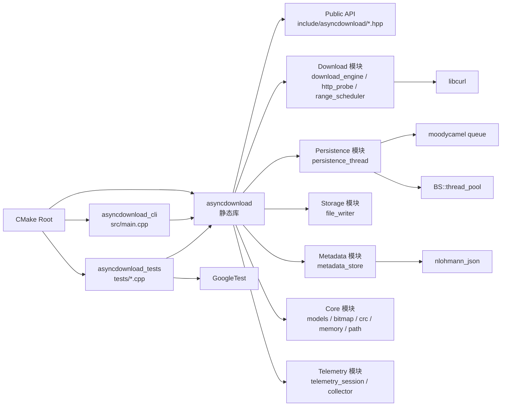
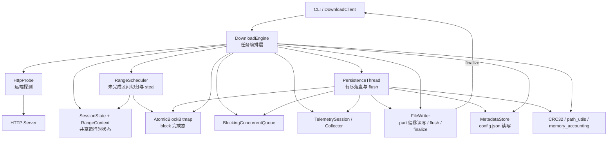
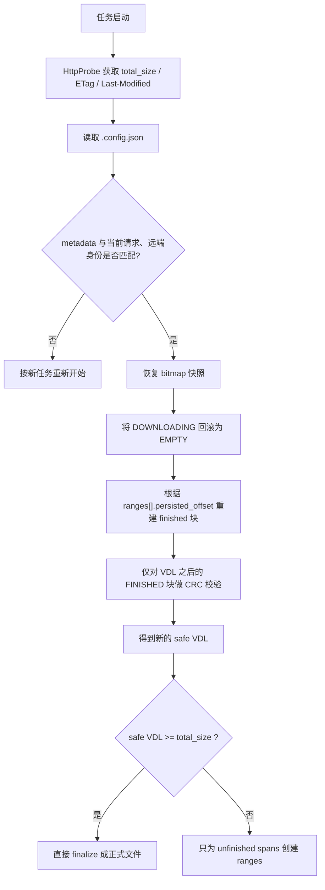

# AsyncDownload 最新程序架构图

本文基于当前仓库实际实现整理，目标是让后续读代码的人先看到当前程序的静态分层、运行时协作关系和恢复链路，再进入具体源码。

当前结论对应的主要源码入口：

- `src/main.cpp`
- `include/asyncdownload/client.hpp`
- `src/client.cpp`
- `src/download/download_engine.cpp`
- `src/download/range_scheduler.hpp`
- `src/persistence/persistence_thread.hpp`
- `src/core/models.hpp`
- `src/storage/file_writer.hpp`
- `src/metadata/metadata_store.hpp`
- `include/asyncdownload/telemetry/telemetry_session.hpp`

## 1. 构建视图

当前仓库不是单一可执行程序，而是一个静态库加两个上层入口：

- `asyncdownload`：核心静态库，承载全部下载逻辑
- `AsyncDownload.exe`：CLI，可直接发起下载
- `AsyncDownload_tests.exe`：测试入口，覆盖调度、持久化、恢复、遥测等模块

## 2. 核心模块架构图

这张图描述“谁编排谁、谁依赖谁、谁负责最终状态落地”。

## 3. 运行时线程与数据流

当前实现的关键不是“多线程越多越快”，而是明确把网络生产、磁盘提交和恢复元数据推进拆开：

- 主线程中的 `DownloadEngine` 驱动 libcurl multi 事件循环
- libcurl 回调只负责生成 `DataPacket`
- `PersistenceThread` 独占推进 `persisted_offset`、`bitmap`、`VDL`
- `BS::thread_pool` 只承接异步 `flush + metadata save`

```mermaid
flowchart LR
    subgraph Main["主线程: DownloadEngine / libcurl multi"]
        Probe2["HttpProbe"]
        Multi["curl_multi + easy handles"]
        Callback["WRITEFUNCTION<br/>聚合数据并入队"]
        Schedule2["RangeScheduler<br/>派发 next_window"]
    end

    subgraph QueueLayer["线程间缓冲"]
        DataQueue["BlockingConcurrentQueue<DataPacket>"]
    end

    subgraph PersistThread["后台线程: PersistenceThread"]
        Reorder["按 offset 重排<br/>out_of_order_queue"]
        Align["tail_buffer + 对齐写盘"]
        Bitmap2["更新 bitmap / persisted_offset"]
        FlushPlan["决定是否 flush"]
    end

    subgraph Worker["工作线程池"]
        Flush["FileWriter.flush()"]
        Save["MetadataStore.save()"]
        CRC["生成 CRC 样本并推进 VDL"]
    end

    subgraph Files["本地文件"]
        Part["*.part"]
        Config["*.config.json"]
    end

    Probe2 --> Multi
    Schedule2 --> Multi
    Multi --> Callback
    Callback --> DataQueue
    DataQueue --> Reorder
    Reorder --> Align
    Align --> Bitmap2
    Bitmap2 --> FlushPlan
    FlushPlan --> Flush
    Flush --> Part
    FlushPlan --> CRC
    CRC --> Save
    Save --> Config
```

## 4. 恢复与一致性链路

当前恢复路径的核心是“只信任已经稳定进入磁盘和 metadata 语义的数据”，而不是简单复用旧状态。

## 5. 当前模块职责

| 层级 | 主要文件 | 当前职责 |
| --- | --- | --- |
| 对外接口层 | `include/asyncdownload/types.hpp`, `include/asyncdownload/client.hpp`, `src/client.cpp`, `src/main.cpp` | 暴露 `DownloadClient::download(...)`、定义请求结果结构、处理 CLI 参数和 summary 输出 |
| 下载编排层 | `src/download/download_engine.hpp`, `src/download/download_engine.cpp` | 串联 probe、恢复判定、range 调度、curl 事件循环、网络收尾和最终结果汇总 |
| 调度层 | `src/download/range_scheduler.hpp`, `src/download/range_scheduler.cpp` | 根据 bitmap 生成初始 ranges、按 window 派发请求、运行期从大 range 尾部做 steal |
| 持久化层 | `src/persistence/persistence_thread.hpp`, `src/persistence/persistence_thread.cpp` | 消费 `DataPacket`、处理乱序缓存、推进 `persisted_offset`、更新 bitmap、触发 flush 和 metadata 保存 |
| 存储层 | `src/storage/file_writer.hpp`, `src/storage/file_writer.cpp` | `.part` 文件打开、预分配、偏移读写、flush、rename finalize |
| 元数据层 | `src/metadata/metadata_store.hpp`, `src/metadata/metadata_store.cpp` | 把恢复状态保存到 `.config.json`，并在重启时读回 `MetadataState` |
| 核心状态层 | `src/core/models.hpp`, `src/core/block_bitmap.*`, `src/core/crc32.*`, `src/core/memory_accounting.*`, `src/core/path_utils.*` | 定义 `SessionState` / `RangeContext` / `DataPacket`，维护 block 状态、CRC、内存会计和路径派生 |
| 遥测层 | `include/asyncdownload/telemetry/*.hpp`, `src/telemetry/*.cpp` | 记录首包时间、平均网络速率、平均磁盘速率、内存峰值、暂停次数和包尺寸分布 |
| 测试层 | `tests/download/*`, `tests/persistence/*`, `tests/storage/*`, `tests/telemetry/*`, `tests/core/*` | 校验调度、持久化、恢复、写盘、遥测和基础位图逻辑 |

## 6. 当前程序的主控关系

可以把当前实现理解成三条并行但强约束的链路：

1. 控制链路：`CLI/DownloadClient -> DownloadEngine -> HttpProbe/RangeScheduler`
2. 数据链路：`libcurl callback -> DataPacket queue -> PersistenceThread -> FileWriter`
3. 恢复链路：`PersistenceThread -> flush -> MetadataStore -> 下次启动恢复`

其中真正决定“哪些字节已经安全完成”的不是网络层，而是：

- `PersistenceThread` 推进的 `persisted_offset`
- `AtomicBlockBitmap` 标记的 `FINISHED`
- `MetadataStore` 持久化后的 `VDL + CRC samples`

## 7. 建议阅读顺序

如果后续要继续演进架构，建议按下面顺序读代码：

1. `include/asyncdownload/types.hpp`
2. `src/core/models.hpp`
3. `src/download/download_engine.cpp`
4. `src/download/range_scheduler.cpp`
5. `src/persistence/persistence_thread.cpp`
6. `src/storage/file_writer.cpp`
7. `src/metadata/metadata_store.cpp`
8. `src/telemetry/telemetry_collector.cpp`

如果要看更细的流程图，可以继续阅读 `docs/flowcharts_zh.md`。
