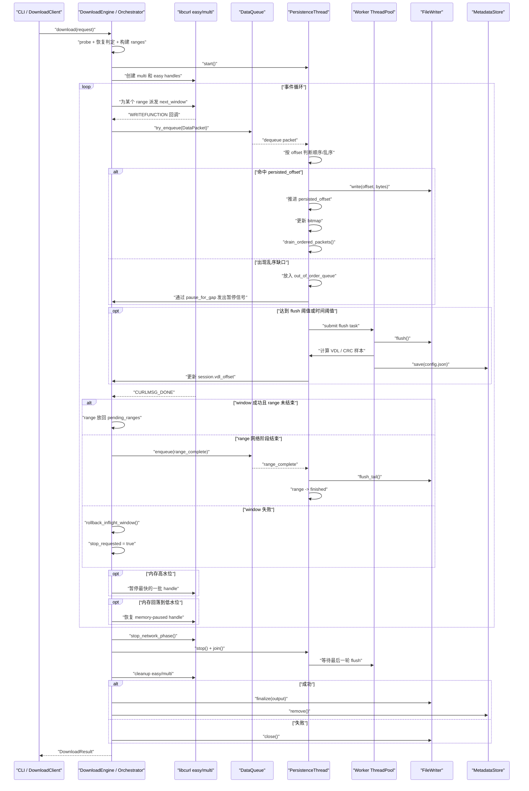
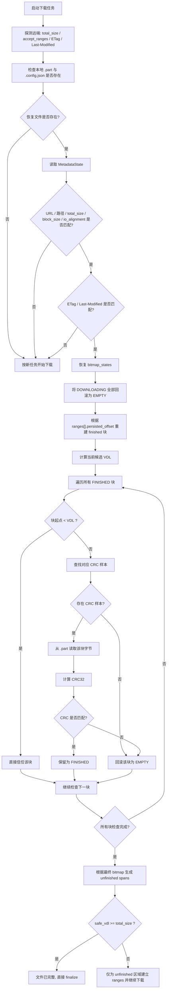

# AsyncDownload Mermaid 流程图

这份文档汇总当前实现对应的三张 Mermaid 图：

- 整体下载流程图
- 线程协作时序图
- 断点续传与恢复判定图

## 1. 整体下载流程图

```mermaid
flowchart TD
    A["DownloadClient / CLI 调用 DownloadEngine::run"] --> B["校验请求参数"]
    B --> C["初始化 libcurl 全局环境"]
    C --> D["HttpProbe 探测远端资源"]
    D --> D1{"HEAD 是否成功且拿到有效长度?"}
    D1 -- "是" --> E["得到 total_size / accept_ranges / ETag / Last-Modified"]
    D1 -- "否" --> D2["回退到 Range 0-0 GET 探测"]
    D2 --> E

    E --> F["构建 SessionState / 临时路径 / metadata 路径"]
    F --> G["加载 config.json"]
    G --> H{"本地 .part + metadata 是否可恢复?"}

    H -- "否" --> I["按新任务打开 .part 并预分配"]
    H -- "是" --> J["打开已有 .part"]
    J --> K["恢复 bitmap 快照"]
    K --> L["将 DOWNLOADING 回滚为 EMPTY"]
    L --> M["根据 RangeStateSnapshot 重建 finished 块"]
    M --> N["对 VDL 之后的 FINISHED 块做 CRC 校验"]
    N --> O{"CRC/状态校验通过?"}
    O -- "否" --> P["回滚坏块为 EMPTY"]
    O -- "是" --> Q["标记 resumed=true"]
    P --> Q

    I --> R["计算 finished_bytes / VDL"]
    Q --> R

    R --> S{"整个文件是否已经完整可恢复?"}
    S -- "是" --> T["直接 finalize: flush + rename + 删除 metadata"]
    T --> U["返回 DownloadResult"]
    S -- "否" --> V["RangeScheduler 根据 bitmap 生成初始 ranges"]

    V --> W["创建 DataQueue / ThreadPool / PersistenceThread"]
    W --> X["注册 ranges 到 PersistenceThread"]
    X --> Y["创建 curl multi 和多个 TransferHandle"]

    Y --> Z["进入 Orchestrator 事件循环"]

    Z --> Z1["检查 PersistenceThread 是否报错"]
    Z1 --> Z2["给空闲 handle 派发下一个 range window"]
    Z2 --> Z3["若无待派发 range, 尝试 steal_largest_range"]
    Z3 --> Z4["arm_transfer: 配置 easy handle + Range window"]
    Z4 --> Z5["curl_multi_perform / curl_multi_wait"]

    Z5 --> Z6["WRITEFUNCTION 收到数据"]
    Z6 --> Z7{"是否 stop / 超出 window / 高水位 / 入队失败?"}
    Z7 -- "是" --> Z8["pause 当前 handle"]
    Z7 -- "否" --> Z9["封装 DataPacket"]
    Z9 --> Z10["更新 downloaded_bytes / queued_packets"]
    Z10 --> AA["try_enqueue 到 DataQueue"]

    AA --> AB["PersistenceThread 消费 DataPacket"]
    AB --> AC{"packet.offset 是否命中 persisted_offset?"}
    AC -- "是" --> AD["append_bytes: tail buffer + 对齐写盘"]
    AD --> AE["更新 persisted_offset / bitmap"]
    AE --> AF["drain_ordered_packets 链式排空 map"]
    AC -- "否" --> AG["放入 out_of_order_queue"]
    AG --> AH["根据 gap 大小更新 pause_for_gap"]

    AF --> AI["按阈值异步 flush + 保存 metadata + 推进 VDL"]
    AH --> AI

    Z5 --> AJ["处理 CURLMSG_DONE"]
    AJ --> AK{"本次 window 是否成功?"}
    AK -- "否" --> AL["rollback_inflight_window + 失败收尾"]
    AK -- "是" --> AM{"range 是否还有剩余字节?"}
    AM -- "是" --> AN["range 放回 pending_ranges"]
    AM -- "否" --> AO["发送 range_complete 控制包"]

    AO --> AP["PersistenceThread flush_tail"]
    AP --> AQ["标记 range finished"]
    AQ --> AI

    Z --> AR["事件循环执行 gap pause / memory backpressure / resume"]
    AR --> AS{"是否还有 active handle 或 pending range?"}
    AS -- "是" --> Z
    AS -- "否" --> AT["停止网络阶段"]

    AL --> AT
    Z1 -->|错误| AT

    AT --> AU["停止 PersistenceThread 并等待 drain + 最终 flush"]
    AU --> AV["根据最终 range 状态重建 bitmap"]
    AV --> AW["清理 curl easy/multi 资源"]

    AW --> AX{"任务是否成功且文件完整?"}
    AX -- "是" --> AY["finalize .part -> 正式文件, 删除 metadata"]
    AX -- "否" --> AZ["保留 .part + config.json 供下次恢复"]

    AY --> BA["返回 DownloadResult"]
    AZ --> BA
```

## 2. 线程协作时序图

```mermaid
sequenceDiagram
    participant CLI as "CLI / DownloadClient"
    participant Engine as "DownloadEngine / Orchestrator"
    participant Curl as "libcurl easy/multi"
    participant Queue as "DataQueue"
    participant Persist as "PersistenceThread"
    participant Pool as "Worker ThreadPool"
    participant File as "FileWriter"
    participant Meta as "MetadataStore"

    CLI->>Engine: "download(request)"
    Engine->>Engine: "probe + 恢复判定 + 构建 ranges"
    Engine->>Persist: "start()"
    Engine->>Curl: "创建 multi 和 easy handles"

    loop "事件循环"
        Engine->>Curl: "为某个 range 派发 next_window"
        Curl-->>Engine: "WRITEFUNCTION 回调"
        Engine->>Queue: "try_enqueue(DataPacket)"

        Queue-->>Persist: "dequeue packet"
        Persist->>Persist: "按 offset 判断顺序/乱序"

        alt "命中 persisted_offset"
            Persist->>File: "write(offset, bytes)"
            Persist->>Persist: "推进 persisted_offset"
            Persist->>Persist: "更新 bitmap"
            Persist->>Persist: "drain_ordered_packets()"
        else "出现乱序缺口"
            Persist->>Persist: "放入 out_of_order_queue"
            Persist->>Engine: "通过 pause_for_gap 发出暂停信号"
        end

        opt "达到 flush 阈值或时间阈值"
            Persist->>Pool: "submit flush task"
            Pool->>File: "flush()"
            Pool->>Persist: "计算 VDL / CRC 样本"
            Pool->>Meta: "save(config.json)"
            Persist->>Engine: "更新 session.vdl_offset"
        end

        Curl-->>Engine: "CURLMSG_DONE"
        alt "window 成功且 range 未结束"
            Engine->>Engine: "range 放回 pending_ranges"
        else "range 网络阶段结束"
            Engine->>Queue: "enqueue(range_complete)"
            Queue-->>Persist: "range_complete"
            Persist->>File: "flush_tail()"
            Persist->>Persist: "range -> finished"
        else "window 失败"
            Engine->>Engine: "rollback_inflight_window()"
            Engine->>Engine: "stop_requested = true"
        end

        opt "内存高水位"
            Engine->>Curl: "暂停最快的一批 handle"
        end

        opt "内存回落到低水位"
            Engine->>Curl: "恢复 memory-paused handle"
        end
    end

    Engine->>Curl: "stop_network_phase()"
    Engine->>Persist: "stop() + join()"
    Persist->>Pool: "等待最后一轮 flush"
    Engine->>Curl: "cleanup easy/multi"

    alt "成功"
        Engine->>File: "finalize(output)"
        Engine->>Meta: "remove()"
    else "失败"
        Engine->>File: "close()"
    end

    Engine-->>CLI: "DownloadResult"
```

## 3. 断点续传与恢复判定图

```mermaid
flowchart TD
    A["启动下载任务"] --> B["探测远端: total_size / accept_ranges / ETag / Last-Modified"]
    B --> C["检查本地 .part 与 .config.json 是否存在"]
    C --> D{"恢复文件是否存在?"}

    D -- "否" --> E["按新任务开始下载"]

    D -- "是" --> F["读取 MetadataState"]
    F --> G{"URL / 路径 / total_size / block_size / io_alignment 是否匹配?"}
    G -- "否" --> E

    G -- "是" --> H{"ETag / Last-Modified 是否匹配?"}
    H -- "否" --> E
    H -- "是" --> I["恢复 bitmap_states"]

    I --> J["将 DOWNLOADING 全部回滚为 EMPTY"]
    J --> K["根据 ranges[].persisted_offset 重建 finished 块"]
    K --> L["计算当前候选 VDL"]

    L --> M["遍历所有 FINISHED 块"]
    M --> N{"块起点 < VDL ?"}
    N -- "是" --> O["直接信任该块"]
    N -- "否" --> P["查找对应 CRC 样本"]

    P --> Q{"存在 CRC 样本?"}
    Q -- "否" --> R["回滚该块为 EMPTY"]
    Q -- "是" --> S["从 .part 读取该块字节"]
    S --> T["计算 CRC32"]
    T --> U{"CRC 是否匹配?"}
    U -- "是" --> V["保留为 FINISHED"]
    U -- "否" --> R

    O --> W["继续检查下一块"]
    V --> W
    R --> W
    W --> X{"所有块检查完成?"}
    X -- "否" --> M
    X -- "是" --> Y["根据最终 bitmap 生成 unfinished spans"]

    Y --> Z{"safe_vdl >= total_size ?"}
    Z -- "是" --> AA["文件已完整, 直接 finalize"]
    Z -- "否" --> AB["仅为 unfinished 区域建立 ranges 并继续下载"]
```

